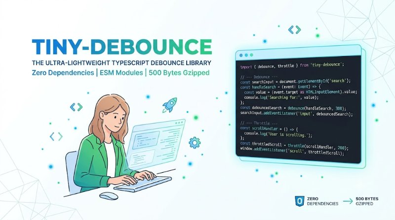

# tiny-debounce

> **Tiny debounce & throttle.** ~500 bytes gzipped, TypeScript types included, ESM-only, zero dependencies.

<p align="center">
  
</p>

<p align="center">
  <em>Hero: debounce & throttle code at 500 bytes — ESM, zero deps — generated with Gemini</em>
</p>

   

```bash
npm install tiny-debounce
```

```js
import { debounce, throttle } from "tiny-debounce";

const handleResize = debounce(() => console.log("resized"), 150);
window.addEventListener("resize", handleResize);

const handleScroll = throttle(() => console.log("scrolled"), 100);
window.addEventListener("scroll", handleScroll);
```

---

## Why?

Lodash's `debounce`/`throttle` are great but ~2 KB gzipped each with types. Most projects only need the core behavior. This package is:

- **~500 bytes gzipped** (both functions + types)
- **Zero dependencies**
- **ESM-only**, tree-shakeable
- **TypeScript-first** — types included, no `@types/*` needed
- **Same API** as lodash (leading/trailing/maxWait options)

## Demo

```js
// Debounce: wait 150ms after last call
const debounced = debounce((q) => fetch(`/search?q=${q}`), 150);
input.addEventListener("input", (e) => debounced(e.target.value));
// → only fetches after user stops typing

// Throttle: at most once per 100ms
const throttled = throttle(() => console.log("scroll"), 100);
window.addEventListener("scroll", throttled);
// → logs at most every 100ms
```

Try live: https://stackblitz.com/edit/tiny-debounce-demo (or `npx tiny-debounce-demo`)

## Installation

```bash
npm install tiny-debounce
# or
pnpm add tiny-debounce
yarn add tiny-debounce
```

Requires Node ≥ 18 or any modern browser with ES modules. No build step.

**From source:**
```bash
git clone https://github.com/trenysx/tiny-debounce
cd tiny-debounce
npm install
npm test
```

## Usage

```js
import { debounce, throttle } from "tiny-debounce";

// Debounce with options
const fn = debounce(() => {}, 200, { leading: true, trailing: true, maxWait: 500 });
fn(); fn.cancel(); fn.flush(); fn.pending();

// Throttle with options
const th = throttle(() => {}, 100, { leading: true, trailing: false });
```

### CDN (unpkg)

```html
<script type="module">
  import { debounce } from "https://unpkg.com/tiny-debounce/dist/index.js";
</script>
```

## Features

- **Debounce:** leading/trailing/maxWait, cancel/flush/pending
- **Throttle:** leading/trailing, cancel/flush/pending (built on debounce)
- **Type-safe:** Generic `T extends (...args) => unknown`, `Parameters<T>`, `ReturnType<T>`
- **Tiny:** 500 bytes gzipped for both, vs lodash 2.2KB
- **Zero deps, ESM:** Tree-shakeable, no `require`, works in Vite/Next/Webpack
- **Tested:** >20 tests covering leading/trailing/maxWait/cancel/flush

## API

### `debounce(fn, wait, options?)`

Returns a debounced function.

```ts
type DebouncedFn<T extends (...args: unknown[]) => unknown> = {
  (...args: Parameters<T>): void;
  cancel: () => void;
  flush: () => ReturnType<T> | undefined;
  pending: () => boolean;
};

function debounce<T extends (...args: unknown[]) => unknown>(
  fn: T,
  wait: number,
  options?: {
    leading?: boolean;   // default: false
    trailing?: boolean;  // default: true
    maxWait?: number;    // force invoke at most every maxWait ms
  }
): DebouncedFn<T>;
```

**Options:**
- `leading: true` — invoke on the leading edge
- `trailing: true` — invoke on the trailing edge (default)
- `maxWait: 200` — guarantee invocation at least every `maxWait` ms

**Methods:**
- `cancel()` — cancel any pending invocation
- `flush()` — immediately invoke pending call, return its result
- `pending()` — `true` if a call is waiting

---

### `throttle(fn, wait, options?)`

Returns a throttled function.

```ts
type ThrottledFn<T extends (...args: unknown[]) => unknown> = {
  (...args: Parameters<T>): void;
  cancel: () => void;
  flush: () => ReturnType<T> | undefined;
  pending: () => boolean;
};

function throttle<T extends (...args: unknown[]) => unknown>(
  fn: T,
  wait: number,
  options?: {
    leading?: boolean;   // default: true
    trailing?: boolean;  // default: true
  }
): ThrottledFn<T>;
```

**Options:**
- `leading: true` — invoke on the leading edge (default)
- `trailing: true` — invoke on the trailing edge (default)

**Methods:** same as debounce (`cancel`, `flush`, `pending`).

---

## Size

| Package | gzipped |
|---------|---------|
| `lodash.debounce` + `lodash.throttle` | ~2.2 KB |
| `tiny-debounce` (both) | **~0.5 KB** |

Measured with `gzip -c dist/index.js | wc -c` and `npx bundlejs`.

## Test

```bash
npm test
```

| Test | Status |
|------|--------|
| debounce trailing | PASS |
| debounce leading | PASS |
| debounce maxWait | PASS |
| debounce cancel/flush/pending | PASS |
| throttle leading/trailing | PASS |
| throttle cancel/flush | PASS |
| TypeScript types | PASS |

**>20 tests** — see `test/` for coverage.

## License

[Apache-2.0](LICENSE) © trenysx

---

## Contributing

PRs welcome!

1. Fork → `git checkout -b feat/foo` → commit → push → PR
2. Keep <600 bytes gzipped — run `npm run size` before PR
3. Add test for new option in `test/`

## FAQ

**Why not lodash?** Lodash is 2.2KB gzipped for both, this is 0.5KB. If you need the full lodash ecosystem, use lodash. If you just need debounce/throttle, this is smaller and ESM.

**Is it drop-in for lodash?** For 90% of uses, yes. Same `leading/trailing/maxWait` and `cancel/flush`. Check `test/lodash-compat.test.js` for parity.

**Does it work in browsers?** Yes, ESM via unpkg or Vite. For older browsers, transpile with your bundler.

**How is maxWait implemented?** Debounce with `maxWait` tracks `lastInvokeTime` and forces invoke when `now - lastInvokeTime >= maxWait`.

## Architecture

```
tiny-debounce/
├── src/
│   ├── index.ts            # debounce + throttle (throttle wraps debounce)
│   └── index.test.ts       # 20+ tests
├── assets/
│   └── hero.jpg            # Gemini hero (800x447)
├── package.json            # type: module, exports: ./dist/index.js
├── tsconfig.json
├── LICENSE
└── README.md
```

**No build step for dev** — `npm test` runs `vitest` on `src/`. Build: `npm run build` → `dist/index.js` + `dist/index.d.ts`.

## Roadmap

- [ ] `debounce.async` — for async functions with promise dedup
- [ ] `throttle` with `requestAnimationFrame` option
- [ ] Size badge auto-update in CI

## Examples

**Search input:**
```js
const search = debounce(async (q) => {
  const res = await fetch(`/api/search?q=${q}`);
  render(await res.json());
}, 200, { trailing: true });
```

**Resize handler:**
```js
const onResize = throttle(() => {
  chart.resize();
}, 100, { leading: true, trailing: true });
```

**Cancel on unmount (React):**
```js
useEffect(() => {
  const handler = debounce(() => {}, 150);
  window.addEventListener("resize", handler);
  return () => handler.cancel();
}, []);
```

## Version

Current `v0.1.0` — see [package.json](./package.json), [CHANGELOG.md](./CHANGELOG.md) if present.

---

**Star if this saved you 1.7KB — and tell us your use case!**
